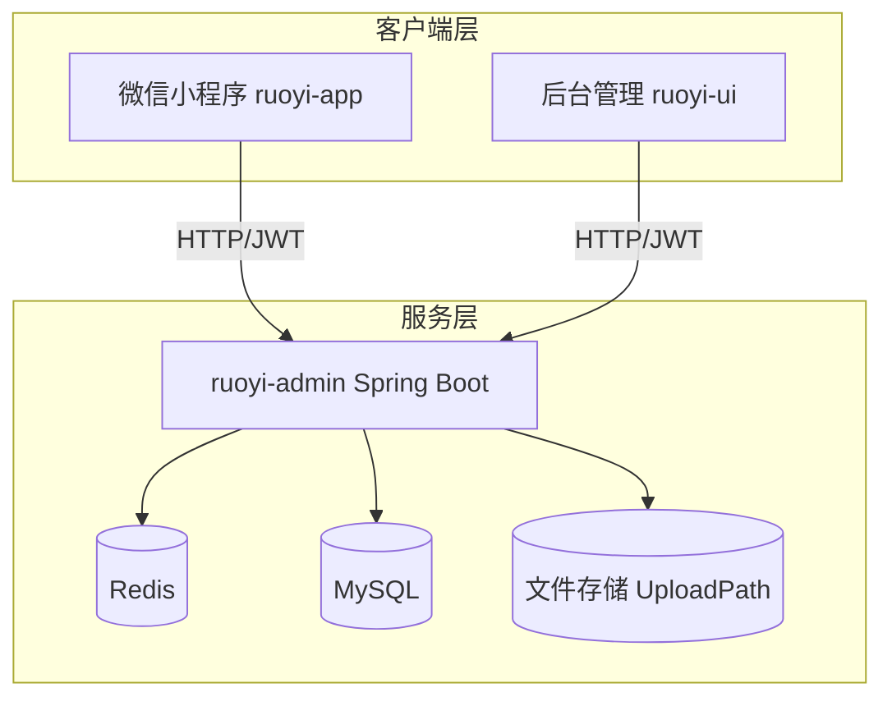
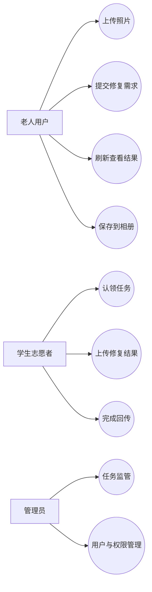
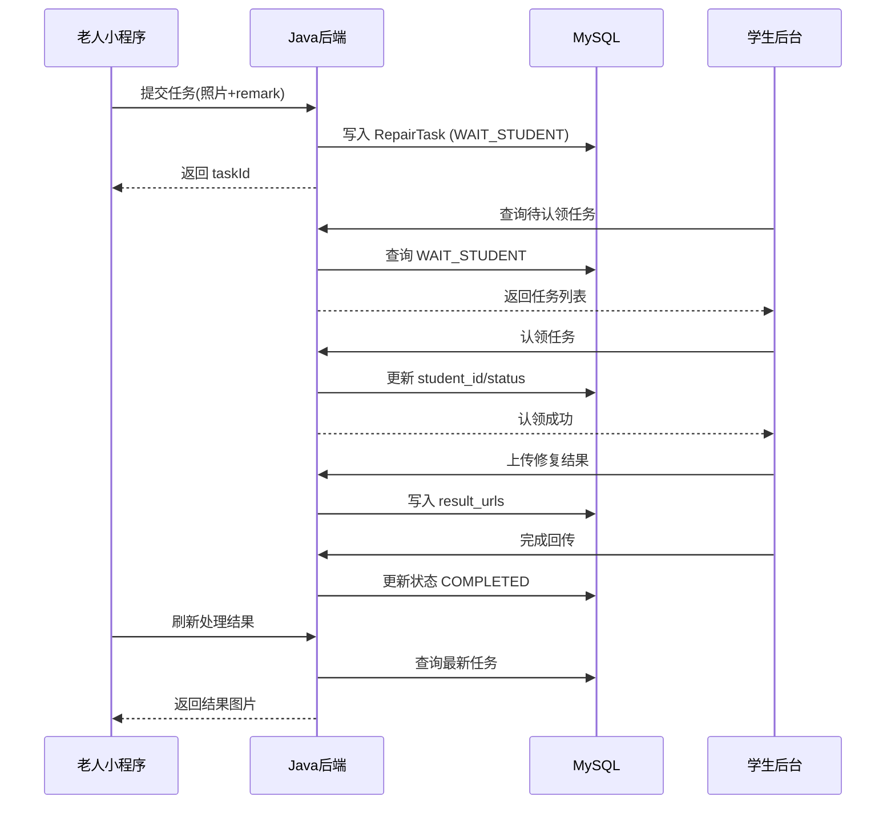
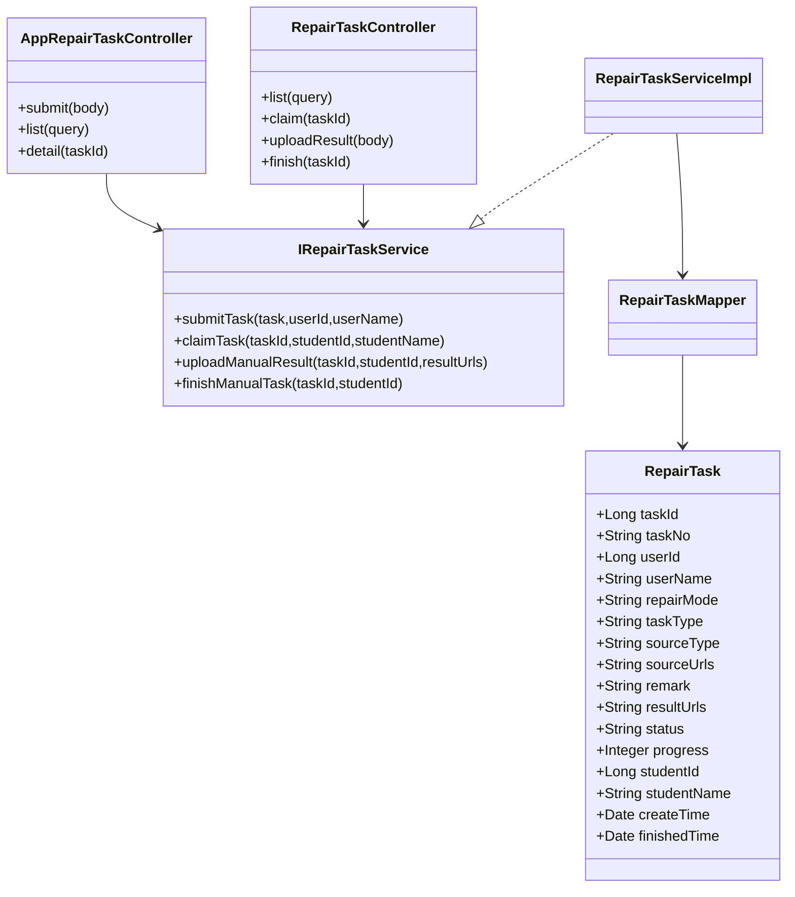
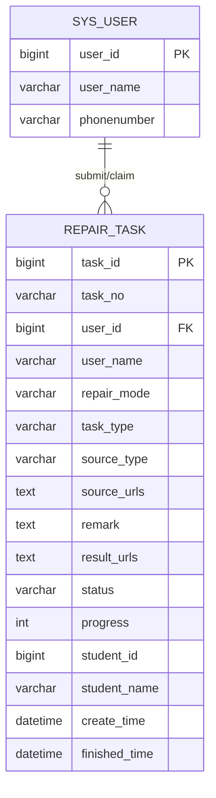
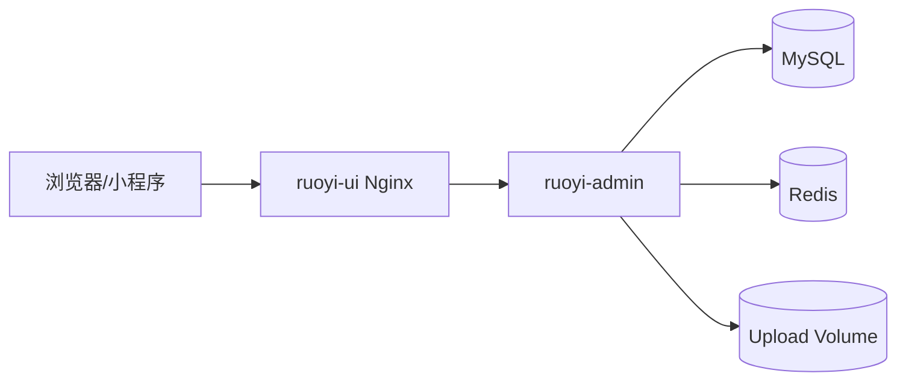

# e起守忆影像修复平台（社区志愿者版）

[](LICENSE)
[]()
[]()
[]()
[]()

---

## 目录

- 项目简介
- 技术栈
- 项目结构
- 系统架构图
- UML 用例图
- 核心时序图
- 领域类图
- 数据库 ER 图
- 部署架构图（Docker）
- 业务流程
- 快速开始
- Docker 部署
- 项目背景说明
- 更新记录

---

## 项目简介

e起守忆影像修复平台是面向社区老人的公益修复系统，采用统一志愿者处理模式：

- 老人在小程序上传老照片并填写需求。
- 任务直接进入学生志愿者处理队列。
- 志愿者在后台认领、修复并回传结果。
- 老人端刷新后预览并保存修复成果。

当前版本已经移除 AI/人工选择分支，交互更简单，适老化更强。

---

## 技术栈

### 后端

- Spring Boot 3.5.x
- Spring Security + JWT
- MyBatis
- MySQL 8
- Redis 7

### 前端

- ruoyi-ui: Vue3 + Element Plus + Vite
- ruoyi-app: uni-app (微信小程序/H5)

### 运维部署

- Docker
- Docker Compose
- Nginx

---

## 项目结构

- ruoyi-admin: Spring Boot 启动与 Web 接口层
- ruoyi-system: 修复任务等核心业务模块
- ruoyi-framework: 安全与权限框架
- ruoyi-common: 公共组件与工具
- ruoyi-ui: 后台管理前端
- ruoyi-app: 小程序前端
- ruoyi-docker: 容器化部署目录
- sql/ry_eqsy_repair.sql: 初始化脚本

---

## 系统架构图



---

## UML 用例图



---

## 核心时序图

### 提交与处理时序



---

## 领域类图



---

## 数据库 ER 图



---

## 部署架构图（Docker）



---

## 业务流程

1. 小程序上传照片。
2. 填写留言需求并提交。
3. 后台学生认领并处理。
4. 上传修复结果，完成回传。
5. 小程序刷新查看并保存。

---

## 快速开始

### 1) 启动后端

```powershell
mvn clean package -DskipTests
cd ruoyi-admin
mvn spring-boot:run
```

### 2) 启动后台前端

```powershell
cd ruoyi-ui
npm install
npm run dev
```

### 3) 小程序调试

- 使用 HBuilderX 打开 ruoyi-app，点击「运行 → 小程序-微信」。
- `ruoyi-app/config.js` 已按 `NODE_ENV` 自动切换地址：开发模式用本地 `http://127.0.0.1:8080`，发行模式用云端地址，无需手动修改。
- **发行正式版前**：微信小程序线上版要求 HTTPS，需在服务器配置 nginx + SSL 证书，并将 `config.js` 生产 `baseUrl` 改为 `https://域名/prod-api`，同时在微信公众平台配置服务器域名白名单。

---

## Docker 部署

Docker 目录位于 ruoyi-docker，已包含：

- docker-compose.yml
- ruoyi-admin/Dockerfile
- ruoyi-ui/Dockerfile
- nginx/default.conf
- .env.example

### 部署步骤

```powershell
cd ruoyi-docker
Copy-Item .env.example .env
# 编辑 .env，填入真实 WECHAT_SECRET
docker compose up -d --build
```

**v1.2.0 新增步骤**：
- 复制 `.env.example` 为 `.env` 后，将 `WECHAT_SECRET` 替换为真实密钥（已预填 AppID，只需填 Secret）。
- `mysql-init/ry_eqsy_repair.sql` 中已包含 `wx_openid` 列，全新部署无需额外执行迁移脚本。
- 已有数据库（非 Docker 初始化）需单独执行 `sql/v1_2_0_migration.sql`（⚠️ 仅执行一次）。

### 默认访问

- 后台前端: http://服务器IP:80
- 后端接口: http://服务器IP:8080

---

## 项目背景说明

- 基于 RuoYi 框架进行二次开发。
- 服务于江苏省常州市武进区社区志愿者活动场景。
- 由江苏理工学院委托开发。

---

## 更新记录

### v1.2.0（微信一键登录 + 双环境配置）

**功能1：微信小程序一键登录 / 自动注册**
- 登录页新增「微信一键登录」绿色按钮（位于密码/短信登录表单下方，分隔线隔开）。
- 前端调用 `uni.login()` 获取临时 `code`，发送至后端 `/wxLogin` 接口。
- 后端通过 `code2session` 接口向微信服务器换取 `openid`；若该 `openid` 首次登录则自动创建用户（无需填写任何信息），返回 JWT Token 直接进入 App。
- `sys_user` 表新增 `wx_openid VARCHAR(64)` 列，并加唯一索引（已同步至 `ry_eqsy_repair.sql`）。
- `SysUser.java` 新增 `wxOpenId` 字段及 getter/setter。
- `SysUserMapper`（接口 + XML）新增 `selectUserByWxOpenId` 查询；`insertUser` SQL 支持 `wx_openid` 写入。
- `ISysUserService` / `SysUserServiceImpl` 新增对应方法。
- `SecurityConfig.java` 白名单追加 `/wxLogin`。
- `application.yml` 已填入真实 `wechat.appid`（`wx1ab607ec500707c0`）与 `wechat.secret`。
- `api/login.js` 新增 `wxLoginApi`。
- ✅ **已验证**：微信登录全链路（code2session → 自动注册 → Token → 进入 App）测试通过。

**功能2：前端双环境自动切换**
- `ruoyi-app/config.js` 改为按 `NODE_ENV` 自动选择后端地址：
  - HBuilderX **「运行」**（开发）→ `http://127.0.0.1:8080`（本地后端）
  - HBuilderX **「发行」**（生产）→ `http://ruoyi.inmind-lab.com:33397`（云端）
- 日常开发无需手动切换 URL。

**部署操作：**
1. **全新数据库**：直接导入 `sql/ry_eqsy_repair.sql`（已包含 `wx_openid` 列及索引）。
2. **已有数据库升级**：执行 `sql/v1_2_0_migration.sql`（⚠️ 仅执行一次，不可重复）。
3. 确保小程序 `manifest.json` 中的 `mp-weixin.appid` 与后端 `wechat.appid` 一致（当前均为 `wx1ab607ec500707c0`）。
4. 短信登录注意：当前验证码为**模拟发送**（验证码直接回传到接口响应），若需真实发送需购买短信服务（阿里云 SMS / 腾讯云 SMS）并替换 `sendSmsCode` 实现。

---

### v1.1.0（多图上传 + 视频结果）

**功能1：小程序多图上传**
- `work/index.vue` 支持单次最多选择 5 张照片，逐张串行上传，显示 "已选 N/5 张" 及单图移除按钮。

**功能2：视频结果上传与下载**
- 后台 `student/index.vue` 新增"动态视频"上传入口（≤10 MB，mp4/mov），上传后可预览及移除。
- 新增 `PUT /repair/task/manual/video` 接口，将视频 URL 单独存储到 `result_video_url` 字段。
- 小程序工作台收到视频结果后自动播放，并提供"下载视频到手机"按钮。
- `MimeTypeUtils.java` 允许列表加入 `mov` 格式。
- `RepairTaskMapper` 新增 `updateResultVideoUrl` 专用方法，绕开 GBK 实体编码限制。

**待手动操作（部署前必须完成）：**
1. 在 `RepairTask.java` 中添加 `resultVideoUrl` 字段及 getter/setter（见 `sql/v1_1_0_migration.sql`）。
2. 生产库执行 `sql/v1_1_0_migration.sql`（含列存在检查，可安全重复执行）。
   ⚠️ 注意：两步必须同时完成，否则 MyBatis 查询时会报 ReflectionException。

---

### 2026-03-27（v1.0.4）

- 修复 `upload.js` 网络失败时 `error.errMsg` 未处理导致崩溃的问题（与 `request.js` 同类 bug）。
- 修复「保存到相册」功能：`uni.saveImageToPhotosAlbum` 需本地临时路径，改为先 `uni.downloadFile` 再保存。
- 更新生产环境 `config.js` 中 `baseUrl` 为 `https://ruoyi.inmind-lab.com/prod-api`，区分开发/生产环境。
- Nginx 新增 `/profile/` 反向代理规则，保障生产环境上传图片的正常访问。
- `application.yml` 文件上传路径由 Windows 路径改为 Linux 路径 `/home/ruoyi/uploadPath`。

### 2026-03-27（v1.0.3）

- 修复短信登录/注册接口 `/sendSmsCode`、`/smsLogin` 未加入 Spring Security 白名单导致 401 的问题。
- 修复 `request.js` 网络请求失败时 `error.message` 为 undefined 引发崩溃的问题。
- 修复工作台图片显示 500 错误：后端返回的 `resultUrls` 为相对路径，统一拼接 `baseUrl` 处理。
- 首页副标题文案更新为「让科技有温度 让记忆有归处」。
- Docker 镜像添加 `version=1.0.3` LABEL。

### 2026-03-17

- 去除小程序 AI/人工选择，统一为志愿者处理。
- 优化工作台步骤文案为 1/2/3。
- 修复结果区按钮可点击性问题。
- 新增刷新 loading 动画。
- 新增 ruoyi-docker 容器化部署目录。
- README 重构为软件工程文档风格（含 UML/时序图/架构图/ER 图）。
