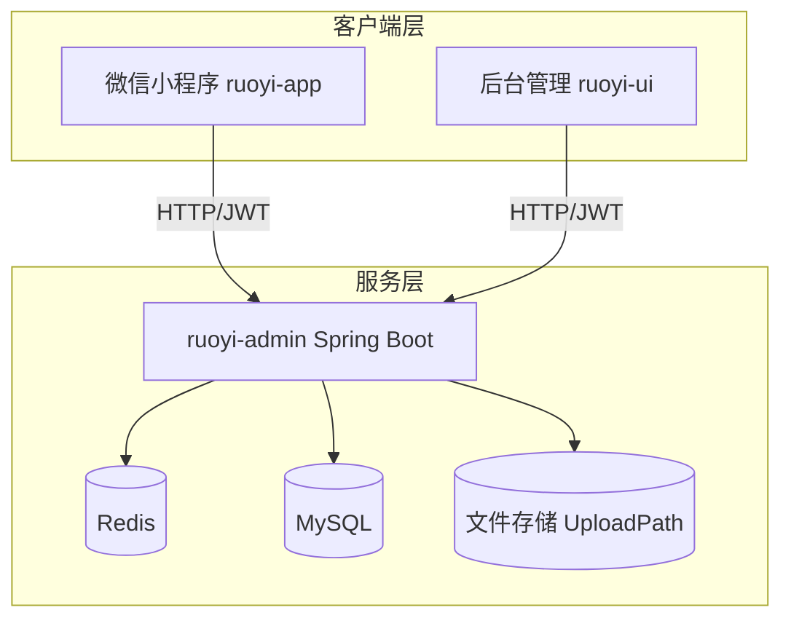
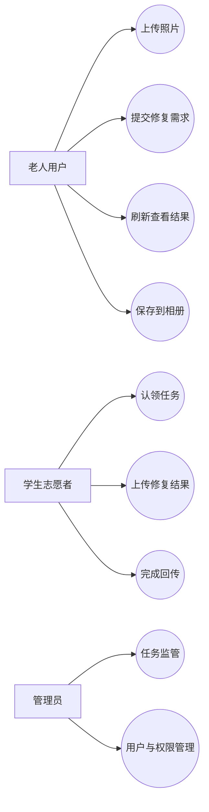
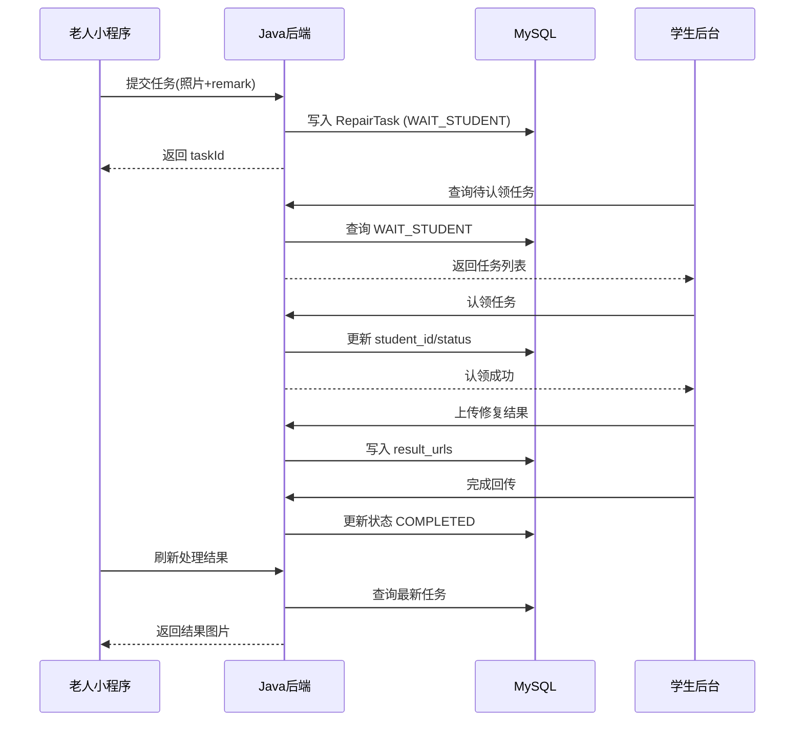
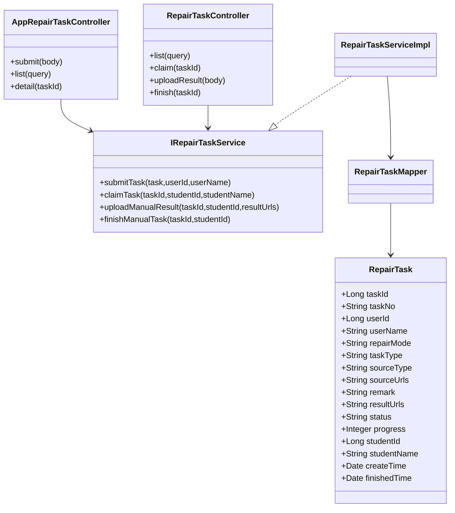
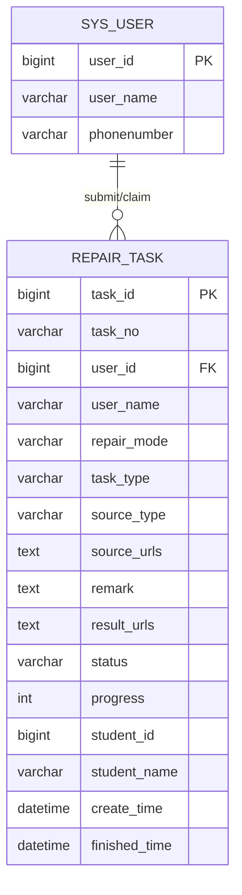
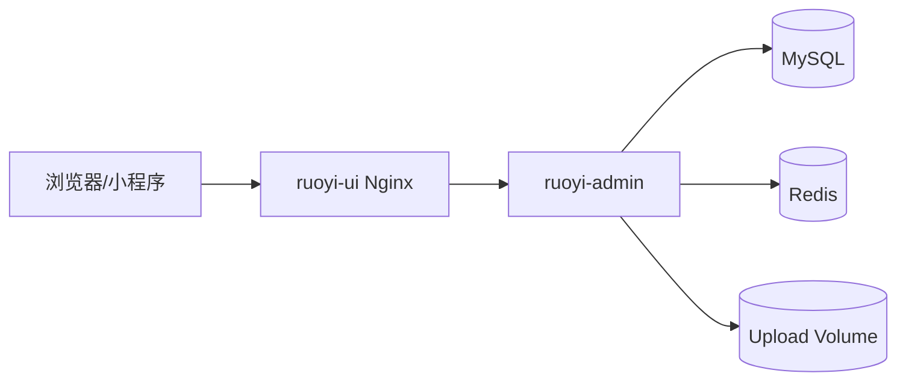

# e起守忆影像修复平台（社区志愿者版）

[](LICENSE)
[]()
[]()
[]()
[]()

---

## 目录

- 项目简介
- 技术栈
- 项目结构
- 系统架构图
- UML 用例图
- 核心时序图
- 领域类图
- 数据库 ER 图
- 部署架构图（Docker）
- 业务流程
- 快速开始
- Docker 部署
- 项目背景说明
- 更新记录

---

## 项目简介

e起守忆影像修复平台是面向社区老人的公益修复系统，采用统一志愿者处理模式：

- 老人在小程序上传老照片并填写需求。
- 任务直接进入学生志愿者处理队列。
- 志愿者在后台认领、修复并回传结果。
- 老人端刷新后预览并保存修复成果。

当前版本已经移除 AI/人工选择分支，交互更简单，适老化更强。

当前 README 对应版本：`v1.6.0（2026.4.13）`

---

## 技术栈

### 后端

- Spring Boot 3.5.x
- Spring Security + JWT
- MyBatis
- MySQL 8
- Redis 7

### 前端

- ruoyi-ui: Vue3 + Element Plus + Vite
- ruoyi-app: uni-app (微信小程序/H5)

### 运维部署

- Docker
- Docker Compose
- Nginx

---

## 项目结构

- ruoyi-admin: Spring Boot 启动与 Web 接口层
- ruoyi-system: 修复任务等核心业务模块
- ruoyi-framework: 安全与权限框架
- ruoyi-common: 公共组件与工具
- ruoyi-ui: 后台管理前端
- ruoyi-app: 小程序前端
- ruoyi-docker: 容器化部署目录
- sql/ry_eqsy_repair.sql: 初始化脚本

---

## 系统架构图



---

## UML 用例图



---

## 核心时序图

### 提交与处理时序



---

## 领域类图



---

## 数据库 ER 图



---

## 部署架构图（Docker）



---

## 业务流程

1. 小程序上传照片。
2. 填写留言需求并提交。
3. 后台学生认领并处理。
4. 上传修复结果，完成回传。
5. 小程序刷新查看并保存。

---

## 快速开始

### 1) 启动后端

```powershell
mvn clean package -DskipTests
cd ruoyi-admin
mvn spring-boot:run
```

### 2) 启动后台前端

```powershell
cd ruoyi-ui
npm install
npm run dev
```

### 3) 小程序调试

- 使用 HBuilderX 打开 ruoyi-app，点击「运行 → 小程序-微信」。
- `ruoyi-app/config.js` 同时保留了本地与云端两套地址：
  - `localBaseUrl=http://127.0.0.1:8080`
  - `cloudBaseUrl=https://ruoyi-backend.inmind-lab.com`
- 开发环境通过单个开关 `useCloudInDev` 控制整套地址：
  - `false`：前后端联调、图片/视频资源均走本地 `localhost`
  - `true`：开发环境整套改走云端 `https`
- 当前 `baseUrl` 与 `staticUrl` 保持一致，避免接口地址与图片/视频资源地址分离后不便切换。
- **发行正式版前**：微信小程序线上版要求 HTTPS，需在服务器配置 nginx + SSL 证书，并确保 `config.js` 中的 `cloudBaseUrl` 指向可访问的 HTTPS 后端地址，同时在微信公众平台配置服务器域名白名单。

### 4) uploadPath 目录说明

- 后端上传目录由 `ruoyi.profile` 决定，接口返回的文件相对路径统一为 `/profile/upload/...`。
- **Windows 本地开发**建议使用本地目录，例如：`D:/ruoyi/uploadPath`
- **Linux 服务器部署**保留服务器目录，例如：`/home/ruoyi/uploadPath`
- 当前已支持按运行系统自动切换：Windows 本地运行自动使用 `windowsProfile`，Linux 服务器运行自动使用 `linuxProfile`，无需手动修改配置文件。
- 如果数据库中的图片路径沿用历史记录，但本地 `uploadPath` 下没有对应文件，访问 `/profile/upload/...` 时会出现 404；此时需同步上传目录中的实际文件。

---

## Docker 部署

Docker 目录位于 ruoyi-docker，已包含：

- docker-compose.yml
- ruoyi-admin/Dockerfile
- ruoyi-ui/Dockerfile
- nginx/default.conf
- .env.example

### 部署步骤

PowerShell（Windows）：

```powershell
cd ruoyi-docker
Copy-Item .env.example .env -Force
# 编辑 .env，填入真实 WECHAT_SECRET
docker compose config
docker compose up -d --build
docker compose ps
```

cmd（Windows）/ bash（Linux、macOS）：

```bash
cd ruoyi-docker
# Windows cmd 用 copy，Linux/macOS 用 cp
copy .env.example .env
# cp -f .env.example .env
docker compose config
docker compose up -d --build
docker compose ps
```

### Docker 更新后端代码后的重建步骤

- 如果你修改了 `ruoyi-admin` 的 Java 代码（例如登录、权限、接口、数据库兜底逻辑），仅重新打开小程序**不会生效**，因为 Docker 里的后端镜像还是旧版本。
- 需要在 `ruoyi-docker` 目录重新构建并重启 `ruoyi-admin` 容器：

```powershell
cd ruoyi-docker
docker compose up -d --build ruoyi-admin
docker compose logs -f --tail=200 ruoyi-admin
```

### v1.6.0 推荐 Docker 重建命令（可直接执行）

PowerShell（Windows）：

```powershell
cd ruoyi-docker

# 1) 仅重建后端（Java改动后首选）
docker compose up -d --build --force-recreate ruoyi-admin
docker compose ps
docker compose logs -f --tail=200 ruoyi-admin

# 2) 前后端一起重建（含UI改动）
docker compose up -d --build --force-recreate ruoyi-admin ruoyi-ui
docker compose ps

# 3) 验证容器状态
docker compose ps
docker compose logs --tail=120 ruoyi-admin
docker compose logs --tail=120 ruoyi-ui
```

bash（Linux/macOS）或 cmd（Windows）：

```bash
cd ruoyi-docker

# 1) 仅重建后端（Java改动后首选）
docker compose up -d --build --force-recreate ruoyi-admin
docker compose ps
docker compose logs -f --tail=200 ruoyi-admin

# 2) 前后端一起重建（含UI改动）
docker compose up -d --build --force-recreate ruoyi-admin ruoyi-ui
docker compose ps

# 3) 验证容器状态
docker compose ps
docker compose logs --tail=120 ruoyi-admin
docker compose logs --tail=120 ruoyi-ui
```

> 提示：如果你这次还要执行 v1.6.0 增量 SQL（`sql/upgrade_20260413_repair_task_remove_and_temp_cleanup.sql`），建议先完成 SQL，再执行上述重建步骤。

- 如果你同时改了前端小程序代码，还需要在 HBuilderX 里重新运行/重新发行 `ruoyi-app`。
- 如果你使用的是已有 MySQL 数据卷，`mysql-init` 目录下的初始化 SQL **不会自动重跑**；这类场景应依赖业务代码兜底或手动执行升级 SQL。

### Docker 数据卷与数据库重置（重点）

- 默认 `docker compose up -d --build` 只会重建镜像/容器，**不会删除 MySQL 数据卷**，所以历史数据库会被保留。
- 这就是“改了 SQL 但数据库没变化”的常见原因，命令本身没错，是数据卷持久化策略在生效。

保留现有数据库（推荐日常更新）：

```powershell
cd ruoyi-docker
docker compose down --remove-orphans
docker compose up -d --build
```

重置数据库并重新执行 `mysql-init`（会清空历史数据）：

```powershell
cd ruoyi-docker
docker compose down -v --remove-orphans
docker compose up -d --build
```

- 执行 `down -v` 后，`mysql-data` 卷会被删除；MySQL 首次启动时会重新执行 `ruoyi-docker/mysql-init` 下的 SQL。

全量重拉（MySQL、Redis 都删除后重新拉取，最彻底）：

```powershell
cd ruoyi-docker
docker compose down -v --remove-orphans --rmi all
docker compose pull
docker compose up -d --build --force-recreate
docker compose ps
```

- 该模式会删除容器、网络、数据卷以及镜像；MySQL 和 Redis 都会重新拉取镜像并冷启动。
- 生产环境请勿直接执行 `down -v` / `--rmi all`，除非你已完成数据备份。

### Docker 上传目录说明

- `ruoyi-docker/docker-compose.yml` 中默认通过 `RUOYI_PROFILE` 指定容器内上传根目录，默认值为 `/data/ruoyi/uploadPath`。
- 同一个 `RUOYI_PROFILE` 也会用于 Docker 卷挂载路径，确保后端配置与容器卷目录保持一致。
- 如果你需要修改 Docker 环境下的上传目录，请同时修改 `.env` 中的 `RUOYI_PROFILE`，不要只改其中一处。
- Docker 部署场景下，`RUOYI_PROFILE` 会作为显式覆盖项生效，优先级高于 Windows/Linux 自动切换配置。

### Docker 常见问题补充（v1.6.0）

- `ruoyi-docker/.env.example` 仅作为模板，`WECHAT_SECRET` 必须在 `.env` 中改成你自己的真实密钥；不要把真实密钥提交到仓库。
- 初始化 SQL（`mysql-init`）只会在 MySQL 数据卷首次创建时执行；后续升级请使用增量脚本，避免误以为重启容器会自动迁移。
- 文件持久化依赖 `ruoyi-upload` 卷，若手工清理卷会导致历史上传文件丢失，执行前请先备份。
- 新增“上传临时文件清理”定时任务默认是暂停状态（`status=1`），需人工确认后再启用，避免误删。
- 新增清理策略只处理 `upload/temp` 目录，并且会排除数据库已引用文件，不会删除已入库任务附件。

**历史 v1.2.0 升级步骤**：
- 复制 `.env.example` 为 `.env` 后，将 `WECHAT_SECRET` 替换为真实密钥（已预填 AppID，只需填 Secret）。
- `mysql-init/ry_eqsy_repair.sql` 中已包含 `wx_openid` 列，全新部署无需额外执行迁移脚本。
- 已有数据库（非 Docker 初始化）：打开 `sql/ry_eqsy_repair.sql`，将文件末尾注释掉的两行 `ALTER TABLE` 取消注释并单独运行（仅执行一次）。

### 默认访问

- 后台前端: http://服务器IP:80
- 后端接口: http://服务器IP:8080

---

## 项目背景说明

- 基于 RuoYi 框架进行二次开发。
- 服务于江苏省常州市武进区社区志愿者活动场景。
- 由江苏理工学院委托开发。

---

## 更新记录

### 2026.4.13（v1.6.0）

- 后台新增任务删除能力：管理员可在服务任务管理页直接删除测试任务，缓解任务列表拥堵。
- 删除任务时联动清理附件：删除 `repair_task` 记录后自动删除该任务关联的源图、结果图和结果视频文件。
- 按你的要求，明确取消“志愿者重复上传时自动删除旧文件”策略，避免历史数据误删。
- 新增“上传临时文件安全清理”能力：仅清理 `upload/temp` 中超时且未被数据库任务引用的文件。
- 新增 Quartz 任务入口：`repairFileCleanupTask.cleanUploadTempFiles('48')`，默认暂停，建议灰度启用。
- 新增增量脚本：`sql/upgrade_20260413_repair_task_remove_and_temp_cleanup.sql`（包含 `repair:task:remove` 权限与可选清理任务）。
- Docker 安全修正：`ruoyi-docker/.env.example` 不再包含真实微信密钥，改为占位符。

### 2026.4.13（v1.4.0）

- 小程序微信登录由“分步授权（头像昵称 + 手机号）”调整为“单按钮一键授权登录”，用户点击后直接完成手机号授权并登录，减少操作步骤。
- 移除登录页微信分步授权弹层与相关前置状态校验逻辑，登录流程进一步简化，避免用户在授权页停留造成流失。
- 微信授权新增隐私协议预检查：登录前先调用 `requirePrivacyAuthorize`（可用时），未授权时给出明确提示，避免授权链路中断。
- 修复 iPhone 端一键授权兼容问题：手机号授权结果判断不再强依赖 `errMsg === getPhoneNumber:ok`，改为以 `detail.code` 为主判定，兼容 iOS 机型上的授权返回差异。
- 微信一键登录请求参数简化：仅提交 `phoneCode` 与登录凭证，去除旧分步流程中不再使用的头像昵称前置参数。
- 安卓兼容策略补充：`getPhoneNumber` 回调中改为“`code` 优先登录、隐私检查兜底重试”，减少部分安卓机型授权链路被拦截导致无法继续登录的问题。

#### 建议验收步骤（微信小程序）

1. 前置检查
  - 确认小程序已勾选并发布最新代码。
  - 确认后端已部署包含 `/wxLogin` 最新逻辑的版本。
  - 确认微信公众平台已配置合法请求域名（HTTPS）。

2. 安卓机型验收
  - 打开登录页，勾选隐私政策与服务协议。
  - 点击“微信一键登录”，授权手机号。
  - 预期：直接登录成功并进入首页，无分步授权弹层。
  - 预期：首次微信登录账号可正常自动注册并返回默认账号提示（若后端开启该提示）。

3. iPhone 机型验收
  - 重复安卓步骤，在 iPhone 真机上执行。
  - 预期：即使授权返回 `errMsg` 表现与安卓不同，只要存在 `detail.code` 也能成功登录。
  - 预期：若用户取消手机号授权，页面提示“你已取消手机号授权”，流程不崩溃。

4. 隐私授权链路验收
  - 清空小程序授权记录后重新进入登录页。
  - 点击“微信一键登录”。
  - 预期：先触发隐私授权检查，拒绝时提示“请先同意隐私协议后再登录”。

5. 回归检查
  - 账号密码登录仍可正常使用。
  - 登录页不再出现旧版微信分步授权 UI。
  - 错误网络场景下有明确失败提示，不出现白屏或卡死。

### 2026.4.8（v1.3.0）

- 小程序微信登录流程改为“用户主动触发二步授权”：先授权头像昵称，再授权手机号并登录，不再出现点击微信入口后直接登录的审核风险。
- 登录授权弹层 UI 重做为底部抽屉卡片样式，步骤分层更清晰，按钮层级更明确，适合老年用户点击操作。
- 后端 `/wxLogin` 增加手机号授权码校验：未授权手机号将拒绝登录；并接入微信 `getuserphonenumber` 接口解析手机号。
- 微信自动注册用户资料完善：登录时同步昵称、头像、手机号（可用时）。
- 修复微信头像入库报错：将 `sys_user.avatar` 字段扩容为 `varchar(255)`（后端登录时自动迁移 + SQL 脚本同步），微信注册可完整同步头像 URL，避免长度溢出导致注册失败。
- 微信自动注册账号保持规则：账号按 `yonghuN` 递增生成，初始密码为 `123456`（加密存储），首次登录返回默认账号密码提示。
- 微信端账号角色策略调整：微信自动注册默认绑定 `common` 角色（老年人默认角色），并对历史 `wxLogin` 账号在登录时自动校正为该角色。
- ruoyi-ui 网页注册角色策略调整：后台注册账号默认分配 `repair_student` 角色，登录后直接进入学生修复工作台菜单，不再落到系统管理菜单集合。
- 兼容历史角色数据：非微信账号若误分配为 `common` 角色，将在网页登录时自动校正为 `repair_student`，避免出现“学生账号看不到修复工作台、却看到系统管理菜单”的错配。
- `common` 角色菜单权限收敛：仅保留修复业务菜单（`修复任务管理`、`学生修复工作台` 及必要子权限），移除系统管理/监控/工具相关菜单权限；登录时自动纠偏历史脏权限。
- “我的”页面能力补齐：新增“修改登录密码”入口，支持在小程序端完成密码维护。
- 个人信息页新增“登录账号”展示与编辑能力，支持用户自行修改登录账号。
- 个人信息页身份文案策略更新：管理员保留“管理员”；微信自动注册账号显示“老年人用户”；后台账号继续可按真实角色登录小程序，实现 ruoyi-ui 与 ruoyi-app 双向登录。
- 资料编辑表单校验优化：手机号、邮箱改为“可空，填写后校验格式”，避免微信新用户因空字段无法保存。
- ruoyi-ui 注册流程调整：保留手机号输入，移除短信验证码输入与发送校验，注册仅保留图形验证码校验。
- 修复 ruoyi-ui 学生修复上传弹窗重复点击报错：新增提交锁、按钮 loading/禁用与异常捕获，消除 `数据正在处理，请勿重复提交` 的未处理 Promise 异常。
- 全局主题术语适配社区志愿服务场景（SQL 初始化脚本同步更新）：
  - 部门：`若依科技` → `江苏理工学院`，`深圳总公司` → `志愿服务中心`，`长沙分公司` → `社区服务站`，子部门改为志愿者管理组/活动策划组/技术支持组等。
  - 岗位：`董事长` → `负责老师`，`项目经理` → `指导老师`，`人力资源` → `辅导员`，`普通员工` → `学生志愿者`。
  - 角色：`超级管理员` → `系统管理员`，`普通角色` → `老年用户`，`修复学生` → `学生志愿者`。
  - 菜单：`学生修复工作台` → `志愿服务工作台`，`修复任务管理` → `服务任务管理`，`人工结果上传` → `服务结果上传`。
  - 用户：admin 昵称改为"管理员"，ry 昵称改为"志愿者测试"，通知公告更新为平台相关内容。
  - `repair_task` 表注释更新为"社区志愿服务任务表"。
- 首页数据看板按角色独立展示：管理员查看全量任务数据（管理员视图）；学生志愿者仅展示自己认领的任务（志愿者视图）；老年用户仅展示自己提交的任务（我的任务视图）。
- 后端 `RepairTaskMapper.xml` 新增 `studentId` 过滤条件，支持志愿者按认领维度查询任务列表。
- `/repair/task/trend` 接口权限放宽为 `hasAnyPermi('repair:task:list,repair:task:claim')`，志愿者角色也可查看趋势图。
- ruoyi-ui 术语更新：服务任务列表"认领学生"→"认领志愿者"，状态"等待学生认领"→"等待志愿者认领"，工作台"老人需求"→"用户需求"。
- ruoyi-app 术语全面更新（7 个页面）：登录页"老人影像修复平台"→"社区志愿服务平台"；帮助页"老年人"→"用户"、"学生志愿者"→"志愿者"；关于页、工作页、设置页同步更新；隐私协议与服务协议标题同步。
- 数据库迁移脚本 `migrate_v1.3.0.sql`：包含部门/岗位/角色/菜单/用户/角色菜单权限的增量更新，支持在已有库上直接执行。
- **微信登录授权流程重构**：废弃已失效的 `getUserProfile` API（微信 2022 年起返回"微信用户"默认值），改用 `<button open-type="chooseAvatar">` + `<input type="nickname">` 新组件获取真实微信头像和昵称。
- 微信头像上传策略调整：`chooseAvatar` 返回临时文件路径，登录成功获取 Token 后通过 `uploadAvatar` API 上传到服务器，确保头像持久化存储。
- "我的"页面显示名优先使用 `nickName`（微信昵称），回退到 `userName`（登录账号）；移除"用户名："前缀，直接展示昵称。
- 后端微信登录自动迁移旧账号：`wx_` 前缀的历史登录账号在下次微信登录时自动迁移为 `yonghuN` 格式。
- "我的"页面术语更新："老年关怀服务提醒"→"社区志愿服务提醒"。
- 应用设置页清理：移除未实现的"一键联系社区"和"语音播报"功能（仅 H5 有限支持 speechSynthesis，小程序无效），保留"字体放大"设置。
- 语音播报代码从 setting、mine、help、about 四个页面全部清理。

### 2026.4.8（v1.2.8）

- 小程序弱网链路加固：请求默认超时提升到 30s，上传默认超时提升到 90s。
- 工作台提交流程新增“延迟 + 重试”机制：单张图片上传失败时自动重试 1 次，重试前等待 1200ms。
- 全部图片上传完成后，提交任务接口前固定延迟 600ms 再发送请求。
- 图片/视频下载保存新增超时控制与更明确的网络错误提示。
- Docker Nginx 新增上传体积与代理超时配置（`client_max_body_size`、`proxy_read_timeout` 等），缓解线上代理层超时中断问题。

### 2026.4.8（v1.2.7）

- 修正 Docker 部署命令，补充 PowerShell 与 cmd/bash 两套可执行示例。
- 增加 `docker compose config` 与 `docker compose ps` 校验步骤，减少配置错误导致的启动失败。
- 后端代码更新流程改为 `docker compose up -d --build ruoyi-admin`，并补充日志排查命令。
- 补充 Docker 数据卷行为说明，新增“全量重拉（MySQL+Redis）”命令，明确保留数据、重置数据卷、删镜像重拉三种模式。
- 小程序错误提示链路更新为优先透传后端真实 `msg`，便于定位发布环境异常。

### 2026-04-01（v1.2.5）

- 修复小程序请求地址不符合微信规范问题：微信小程序线上/真机预览环境只允许 HTTPS 请求，`http://127.0.0.1` 在该环境完全不可用，需在微信开发平台添加域名白名单。
- `ruoyi-app/config.js` 中 `useCloudInDev` 由 `false` 改为 `true`，确保开发与生产环境均使用 `cloudBaseUrl`（`https://ruoyi-backend.inmind-lab.com`）。
- 若需本地联调，可临时将 `useCloudInDev` 改回 `false`，并在微信开发者工具中勾选「不校验合法域名」绕过限制。
- `appInfo.version` 同步更新为 `1.2.5`。

### 2026-03-31（v1.2.3）

- 修复微信一键登录报错：生产数据库缺少 `wx_openid` 列导致所有用户查询崩溃，已将迁移语句以注释形式内置于 `sql/ry_eqsy_repair.sql` 末尾（取消注释单独运行两行 `ALTER` 即可）。
- 修复密码登录成功后页面不跳转、无任何反馈的问题：`login.vue` 的 `loginSuccess()` 补充 `getInfo()` 加载状态与 `.catch()` 错误提示。
- 修复 `font-size: undefinedpx` 控制台警告：`avatar/index.vue` 模块层改用 `uni.getWindowInfo()` 获取屏幕信息，并加兜底默认值。
- 修复 `wx.getSystemInfoSync is deprecated` 废弃 API 警告：同上，已替换为新 API。
- 消除 `App.vue` LifeCycle 加载风险：移除顶层 `getCurrentInstance()` 调用，`checkLogin()` 整体收进 `#ifdef H5` 块，改用 `uni.reLaunch()` 原生导航。
- 补充 Docker 场景下后端代码更新后的重建步骤：修改 `ruoyi-admin` 后需执行 `docker compose build ruoyi-admin` 与 `docker compose up -d ruoyi-admin` 使修复真正生效。

### 2026-03-31（v1.2.2）

- README 更新到 `v1.2.2`。
- 补充 `ruoyi-app/config.js` 当前地址切换方式：保留 `localhost` 与云端 `https` 两套地址，通过 `useCloudInDev` 单开关切换整套开发环境。
- 补充 `uploadPath` 双环境说明：Windows 目录用于本地开发联调，Linux 目录用于最终服务器托管部署，两套路径均保留。
- `application.yml` 与 `RuoYiConfig` 已支持按运行系统自动切换 `uploadPath`：Windows 自动使用 `windowsProfile`，Linux 自动使用 `linuxProfile`。
- 补充 Docker 场景下 `RUOYI_PROFILE` 与卷挂载目录的关系说明，避免容器上传目录配置不一致。
- 明确 `/profile/upload/...` 依赖实际上传文件目录，数据库路径存在但物理文件未同步时会出现资源 404。

### 2026-03-30（v1.2.0）

**功能1：微信小程序一键登录 / 自动注册**
- 登录页新增「微信一键登录」绿色按钮（位于密码/短信登录表单下方，分隔线隔开）。
- 前端调用 `uni.login()` 获取临时 `code`，发送至后端 `/wxLogin` 接口。
- 后端通过 `code2session` 接口向微信服务器换取 `openid`；若该 `openid` 首次登录则自动创建用户（无需填写任何信息），返回 JWT Token 直接进入 App。
- `sys_user` 表新增 `wx_openid VARCHAR(64)` 列，并加唯一索引（已同步至 `ry_eqsy_repair.sql`）。
- `SysUser.java` 新增 `wxOpenId` 字段及 getter/setter。
- `SysUserMapper`（接口 + XML）新增 `selectUserByWxOpenId` 查询；`insertUser` SQL 支持 `wx_openid` 写入。
- `ISysUserService` / `SysUserServiceImpl` 新增对应方法。
- `SecurityConfig.java` 白名单追加 `/wxLogin`。
- `application.yml` 已填入真实 `wechat.appid`（`wx1ab607ec500707c0`）与 `wechat.secret`。
- `api/login.js` 新增 `wxLoginApi`。
- ✅ **已验证**：微信登录全链路（code2session → 自动注册 → Token → 进入 App）测试通过。

**功能2：前端双环境自动切换**
- `ruoyi-app/config.js` 改为按 `NODE_ENV` 自动选择后端地址：
  - HBuilderX **「运行」**（开发）→ `http://127.0.0.1:8080`（本地后端）
  - HBuilderX **「发行」**（生产）→ `https://ruoyi-backend.inmind-lab.com`（云端）
- 日常开发无需手动切换 URL。

**部署操作：**
1. **全新数据库**：直接导入 `sql/ry_eqsy_repair.sql`（已包含 `wx_openid` 列及索引）。
2. **已有数据库升级**：打开 `sql/ry_eqsy_repair.sql` 底部迁移说明块，将注释揭掉的两行 `ALTER TABLE` 单独运行（⚠️ 仅执行一次）。
3. 确保小程序 `manifest.json` 中的 `mp-weixin.appid` 与后端 `wechat.appid` 一致（当前均为 `wx1ab607ec500707c0`）。
4. 短信登录注意：当前验证码为**模拟发送**（验证码直接回传到接口响应），若需真实发送需购买短信服务（阿里云 SMS / 腾讯云 SMS）并替换 `sendSmsCode` 实现。

---

### 2026-03-30（v1.1.0）

**功能1：小程序多图上传**
- `work/index.vue` 支持单次最多选择 5 张照片，逐张串行上传，显示 "已选 N/5 张" 及单图移除按钮。

**功能2：视频结果上传与下载**
- 后台 `student/index.vue` 新增"动态视频"上传入口（≤10 MB，mp4/mov），上传后可预览及移除。
- 新增 `PUT /repair/task/manual/video` 接口，将视频 URL 单独存储到 `result_video_url` 字段。
- 小程序工作台收到视频结果后自动播放，并提供"下载视频到手机"按钮。
- `MimeTypeUtils.java` 允许列表加入 `mov` 格式。
- `RepairTaskMapper` 新增 `updateResultVideoUrl` 专用方法，绕开 GBK 实体编码限制。

**待手动操作（部署前必须完成）：**
1. 在 `RepairTask.java` 中添加 `resultVideoUrl` 字段及 getter/setter（见 `sql/v1_1_0_migration.sql`）。
2. 生产库执行 `sql/v1_1_0_migration.sql`（含列存在检查，可安全重复执行）。
   ⚠️ 注意：两步必须同时完成，否则 MyBatis 查询时会报 ReflectionException。

---

### 2026-03-27（v1.0.4）

- 修复 `upload.js` 网络失败时 `error.errMsg` 未处理导致崩溃的问题（与 `request.js` 同类 bug）。
- 修复「保存到相册」功能：`uni.saveImageToPhotosAlbum` 需本地临时路径，改为先 `uni.downloadFile` 再保存。
- 更新生产环境 `config.js` 中 `baseUrl` 为 `https://ruoyi-backend.inmind-lab.com`，区分开发/生产环境。
- Nginx 新增 `/profile/` 反向代理规则，保障生产环境上传图片的正常访问。
- `application.yml` 默认文件上传路径保持 Linux 路径 `/home/ruoyi/uploadPath`，本地 Windows 开发可按需覆盖为本地目录。

### 2026-03-27（v1.0.3）

- 修复短信登录/注册接口 `/sendSmsCode`、`/smsLogin` 未加入 Spring Security 白名单导致 401 的问题。
- 修复 `request.js` 网络请求失败时 `error.message` 为 undefined 引发崩溃的问题。
- 修复工作台图片显示 500 错误：后端返回的 `resultUrls` 为相对路径，统一拼接 `baseUrl` 处理。
- 首页副标题文案更新为「让科技有温度 让记忆有归处」。
- Docker 镜像添加 `version=1.0.3` LABEL。

### 2026-03-17

- 去除小程序 AI/人工选择，统一为志愿者处理。
- 优化工作台步骤文案为 1/2/3。
- 修复结果区按钮可点击性问题。
- 新增刷新 loading 动画。
- 新增 ruoyi-docker 容器化部署目录。
- README 重构为软件工程文档风格（含 UML/时序图/架构图/ER 图）。
